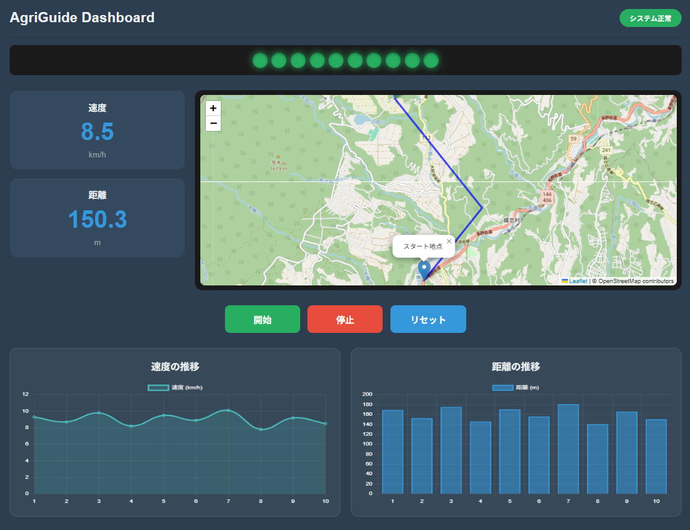

# AgriGuide Dashboard

**農業機械用ガイダンスシステム - リアルタイム走行データ可視化ダッシュボード**

[](https://opensource.org/licenses/MIT)
[](https://www.ecma-international.org/)
[](https://leafletjs.com/)
[](https://www.chartjs.org/)

## 📖 概要

AgriGuide Dashboardは、農業機械の走行データをリアルタイムで可視化するWebアプリケーションです。GPS位置情報、速度、走行距離をインタラクティブな地図とグラフで表示し、効率的な農作業をサポートします。

### 🎯 主な機能

- **リアルタイム地図表示** - Leaflet.jsを使用した現在位置の可視化
- **走行データメーター** - 速度・距離のリアルタイム表示
- **履歴データグラフ** - Chart.jsによる速度・距離の推移可視化
- **操作パネル** - 計測の開始・停止・リセット機能
- **レスポンシブデザイン** - PC・タブレット・スマートフォン対応

## 🖼️ スクリーンショット



## 🛠️ 技術スタック

### フロントエンド
- **HTML5** - セマンティックなマークアップ
- **CSS3** - Flexbox/Gridレイアウト、カスタムプロパティ
- **JavaScript (ES6)** - モダンな非同期処理とDOM操作

### ライブラリ
- **[Leaflet.js 1.9.4](https://leafletjs.com/)** - インタラクティブ地図表示
- **[Chart.js 4.4.1](https://www.chartjs.org/)** - データ可視化（折れ線・棒グラフ）
- **[OpenStreetMap](https://www.openstreetmap.org/)** - 地図タイルプロバイダー

### バックエンド連携
- **REST API** - Java Servlet (Tomcat) との通信
- **JSON** - データ交換フォーマット
- **Fetch API** - 非同期データ取得

## 📁 プロジェクト構成

```
agri-guide-dashboard/
├── index.html           # メインHTMLファイル
├── CSS/
│   └── style.css       # スタイルシート
├── JS/
│   └── app.js          # メインJavaScript
├── screenshot.png      # プロジェクトスクリーンショット
└── README.md           # このファイル
```

## 🚀 セットアップ

### 前提条件

- **Python 3.x** - ローカルサーバー起動用
- **Webブラウザ** - Chrome, Firefox, Edge など（モダンブラウザ推奨）
- **バックエンドサーバー** - [agri-guide-backend](https://github.com/maki-hiradate/agri-guide-backend) が起動していること

### インストール手順

1. **リポジトリのクローン**
   ```bash
   git clone https://github.com/maki-hiradate/agri-guide-dashboard.git
   cd agri-guide-dashboard
   ```

2. **ローカルサーバーの起動**
   ```bash
   python -m http.server 8000
   ```

3. **ブラウザでアクセス**
   ```
   http://localhost:8000/index.html
   ```

## 🔧 設定

### APIエンドポイントの変更

`JS/app.js` の以下の部分を編集：

```javascript
// センサーデータAPI
fetch('http://localhost:8080/agri-guide-backend/api/sensor-data')

// 履歴データAPI
fetch('http://localhost:8080/agri-guide-backend/api/history-data')
```

### 地図の初期位置変更

`JS/app.js` の `initMap()` 関数内：

```javascript
const map = L.map('map').setView([36.5, 138.5], 13); // [緯度, 経度], ズームレベル
```

## 📊 データフロー

```
ブラウザ (localhost:8000)
    ↓ Fetch API
Tomcat (localhost:8080)
    ↓ JDBC
MySQL (agriguide_db)
    ↓
trip_data テーブル
```

## 🎨 デザイン仕様

### カラーパレット
- **プライマリ** - `#1e3c72` (ダークブルー)
- **セカンダリ** - `#2a5298` (ブルー)
- **アクセント** - `#3498db` (ライトブルー)
- **背景** - `#2c3e50` (ダークグレー)

### レスポンシブブレークポイント
- **PC** - 1200px以上
- **タブレット** - 768px〜1199px
- **スマートフォン** - 767px以下

## 📈 今後の拡張予定

- [ ] WebSocket通信によるリアルタイム更新
- [ ] 走行軌跡の記録・再生機能
- [ ] データエクスポート機能（CSV, JSON）
- [ ] 複数機械の同時管理
- [ ] ハードウェア連携（Raspberry Pi + GPS）

## 🤝 コントリビューション

プルリクエストを歓迎します。大きな変更の場合は、まずIssueを開いて変更内容を議論してください。

## 📄 ライセンス

[MIT License](LICENSE)

## 👤 作者

**Maki Hiradate**
- GitHub: [@maki-hiradate](https://github.com/maki-hiradate)

## 🙏 謝辞

- [Leaflet](https://leafletjs.com/) - 優れた地図ライブラリ
- [Chart.js](https://www.chartjs.org/) - 使いやすいグラフライブラリ
- [OpenStreetMap](https://www.openstreetmap.org/) - オープンな地図データ

---

**Built with ❤️ for Smart Agriculture**
